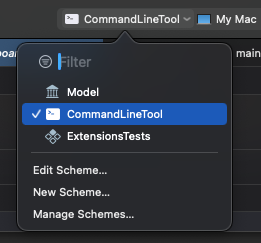
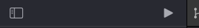
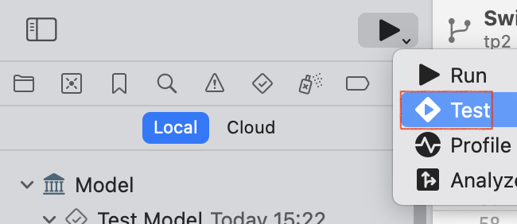
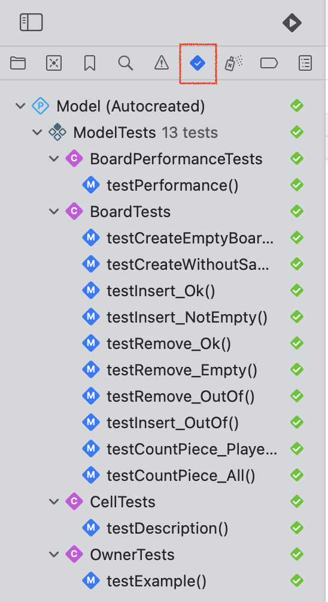

# Project DouShuKi 3ème année

## Comment lancer le projet :

- Cloner le dépot dans xCode
- Selectionner l'application console comme ci dessous

- Cliquer sur le bouton play (cf. image)

## Pour lancer les tests :

- Selectionner le projet de test comme ci dessous

## Voir le resultat de l'execution des tests

- Cliquer dans le menu de gauche sur cet onglet

## Couverture de tests

Suivre les étapes suivante pour voir la couverture de test

1)

2)

