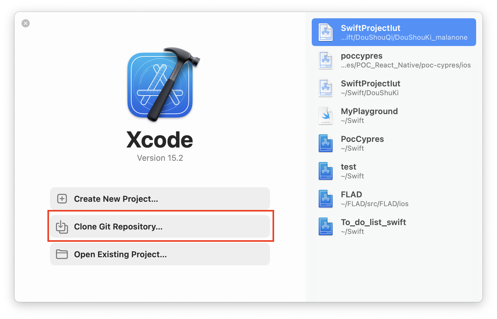
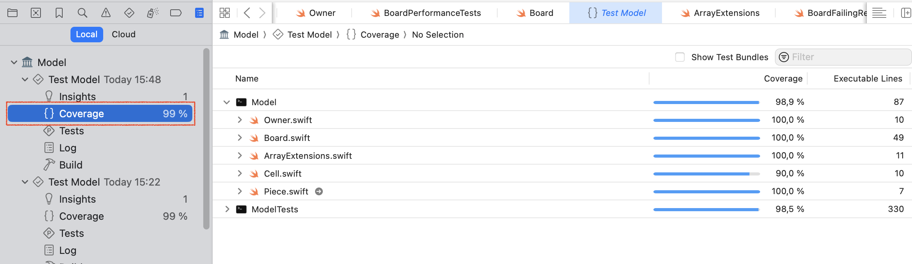

# Project DouShuKi 3ème année

## Cloner le dépot

- Premièrement ouvrer xCode
- Cliquer sur `Clone Git Repository...`

## Comment lancer le projet :

Après avoir cloner le dépot dans xCode
- Selectionner l'application console comme ci dessous

- Cliquer sur le bouton play (cf. image)

## Pour lancer les tests :

- Selectionner le projet de test cliquer sur le bouton suivant 

## Voir le resultat de l'execution des tests

- Cliquer dans le menu de gauche sur cet onglet 

## Couverture de tests

Suivre les étapes suivante pour voir la couverture de test

1) Cliquer sur le menu de gauche sur cet onglet 

2)

3)

## Fonctionnement de la boucle de jeu

Voici un algorithme en language naturel de la manière dont ma boucle de jeu (dans le main) est réalisé.

